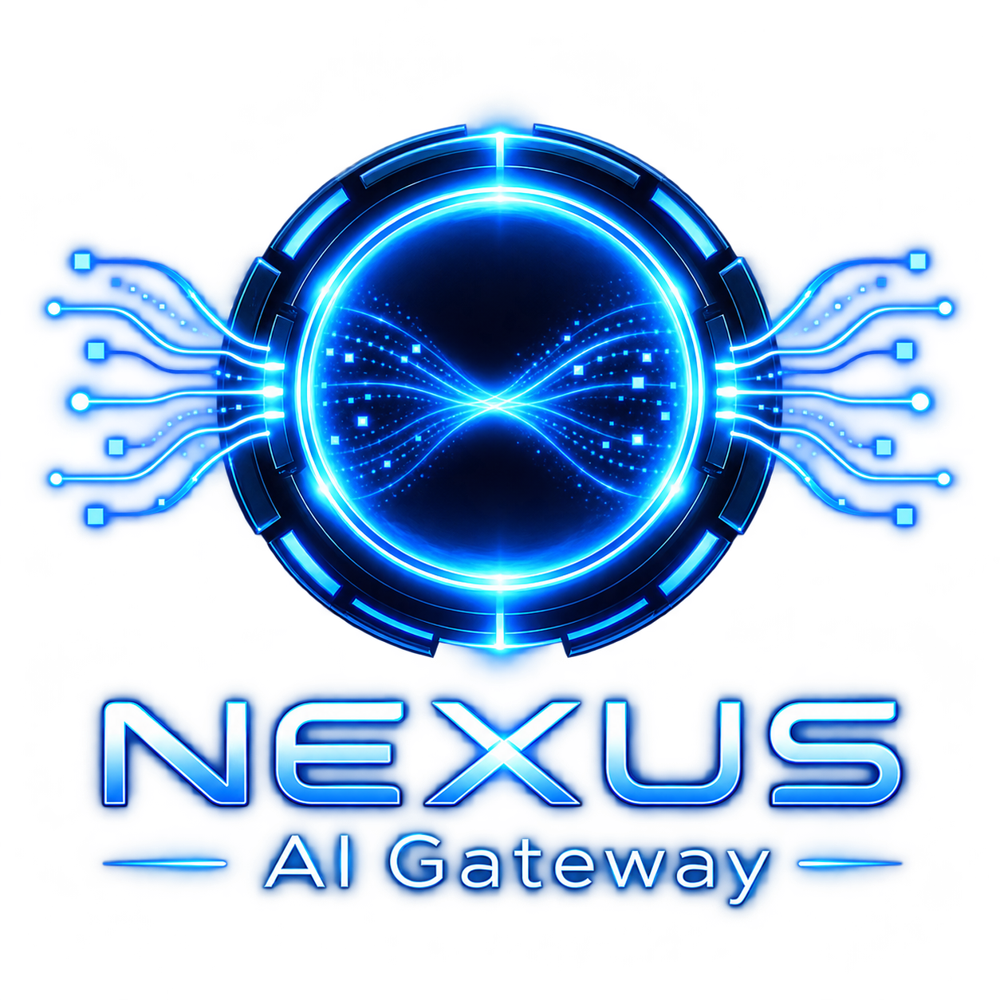

<p align="center">
  
</p>

<h1 align="center">
  NEXUS AI Gateway - The last AI gateway you will ever need
</h1>

</p>


<p align="center">
  NEXUS AI Gateway is the fastest and the most resource-efficient AI Gateway (<a href="https://aigateway.nexusai.run/docs/about/benchmarks?utm_source=readme">the self-reproducible benchmarks</a>). It's an alternative to LiteLLM (which was hacked recently) and Portkey (which is no longer maintained on GitHub).
</p>

<p>
  NEXUS AI Gateway saves you money and nerves.
</p>
<p>
  <strong>Money</strong> - because you can remember the responses on this layer (caching), track your spending and do tricks like prompt compression and intelligent routing.
</p>
<p>
  <strong>Nerves</strong> - because we strive to achieve good quality and reliability. Our ambition is to be the last AI gateway you will need - the most reliable, resource-optimal, feature-rich and fast.
</p>

## Quick Start

**Step 1:** Prepare the NEXUS AI deployment

Clone the repository, create a protected environment file, and authenticate the NEXUS AI CLI:

```bash
git clone https://github.com/nexusrun/nexus_aigateway.git
cd nexusruntime
cp .env.template .env
nexus auth login
```

Configure provider keys, database settings, and dashboard credentials in NEXUS AI deployment environment variables or the protected `.env` file.

ℹ️ See [`.env.template`](./.env.template) for the complete list of environment variables, including all available providers.

**Step 2:** Deploy to NEXUS AI

Push the current source to the repository that NEXUS AI will build, then deploy it through the NEXUS AI CLI:

```bash
git push origin main

nexus deploy source \
  --repo https://github.com/saifelyzal/aigateway.git \
  --name aigateway \
  --branch main \
  --provider docker \
  --services postgresql,redis \
  --dockerfile Dockerfile.nexus \
  --env-file .env \
  --environment PRODUCTION \
  --wait \
  --json
```

Keep provider keys, database credentials, and `ADMIN_SESSION_SECRET` in NEXUS AI environment settings or a protected `.env` file. Do not commit secrets. Verify the deployed source and environment after each build:

```bash
nexus deploy get aigateway --json
nexus deploy status aigateway
nexus deploy logs aigateway --lines 200
```

**Step 3:** Open the dashboard

```text
https://aigateway.nexusai.run/admin/dashboard
```

**Step 4:** Make an API call

```bash
curl https://aigateway.nexusai.run/v1/responses \
  -H "Content-Type: application/json" \
  -H "Authorization: Bearer $NEXUS_AI_API_KEY" \
  -d '{
    "model": "gpt-5-chat-latest",
    "input": "Hello!"
  }'
```

## NEXUS AI Gateway and official SDKs

NEXUS AI Gateway accepts requests in two compatible formats:

- OpenAI-compatible at `/v1`
- Anthropic-compatible at `/v1/messages`

The official SDKs therefore work unchanged. Configure their base URLs as follows:

- OpenAI SDK: `https://aigateway.nexusai.run/v1`
- Anthropic SDK: `https://aigateway.nexusai.run` (the SDK appends `/v1/messages`)

## Use NEXUS AI Gateway with coding tools

NEXUS AI Gateway works with Claude Code, Codex, Cursor, and other coding agents.
Configure the tool to use your gateway URL and a gateway API key, then choose a
model returned by `GET /v1/models`.

For a local gateway, the common OpenAI-compatible endpoint is:

```text
Base URL: http://localhost:8080/v1
API key:  your NEXUS AI Gateway key
```

### Claude Code

Claude Code uses the Anthropic Messages API. Set the gateway URL and token in
your shell, then start Claude Code normally:

```bash
export ANTHROPIC_BASE_URL=http://localhost:8080
export ANTHROPIC_AUTH_TOKEN=your-gateway-key
claude
```

The managed gateway route is `POST /v1/messages`. To pin Claude Code directly
to the Anthropic passthrough, use `http://localhost:8080/p/anthropic` instead.
See the [Claude Code integration guide](https://aigateway.nexusai.run/docs/guides/claude-code?utm_source=readme).

### Codex

Codex uses the OpenAI Responses API. Add a custom provider to
`~/.codex/config.toml`:

```toml
model_provider = "aigateway"
model = "your-model-id"

[model_providers.aigateway]
name = "NEXUS AI Gateway"
base_url = "http://localhost:8080/v1"
env_key = "AIGATEWAY_API_KEY"
wire_api = "responses"
```

Then export the gateway key and run Codex:

```bash
export AIGATEWAY_API_KEY=your-gateway-key
codex
```

See the [Codex integration guide](https://aigateway.nexusai.run/docs/guides/codex?utm_source=readme)
for ChatGPT subscription routing and provider-specific notes.

### Cursor

Cursor can route OpenAI BYOK requests through NEXUS AI Gateway:

1. Open **Cursor Settings → Models**.
2. Set **OpenAI API Key** to a dedicated gateway key.
3. Enable **Override OpenAI Base URL** and enter
   `https://your-gateway.example.com/v1`.
4. Select a model exposed by the gateway.

Cursor requires a publicly reachable HTTPS gateway URL. Use a dedicated managed
API key rather than the gateway master key. Cursor-hosted models, Tab, and some
other Cursor features do not route through the OpenAI base URL override.
See the [Cursor integration guide](https://aigateway.nexusai.run/docs/guides/cursor?utm_source=readme).

### Other coding agents and clients

OpenCode, Cline, Roo Code, OpenAI-compatible SDKs, and similar clients generally
use the same settings:

```text
Base URL: http://localhost:8080/v1
API key:  your NEXUS AI Gateway key
Model:    an ID returned by GET /v1/models
```

See the guide for [OpenCode and other agents](https://aigateway.nexusai.run/docs/guides/opencode-and-other-agents?utm_source=readme),
or the [API endpoints reference](https://aigateway.nexusai.run/docs/advanced/api-endpoints?utm_source=readme)
for client-specific behavior.

## List of Supported LLM Providers

- OpenAI
- Anthropic
- xAI (Grok)
- Google Gemini
- Cohere
- Vertex AI
- DeepSeek
- Groq
- Fireworks AI
- Meta (Muse Spark)
- OpenRouter
- Z.ai
- Alibaba Cloud Model Studio (Bailian)
- Kilo AI
- MiniMax
- Xiaomi MiMo
- OpenCode Go
- Azure OpenAI
- Oracle
- Ollama
- SGLang
- vLLM
- llm-d
- Amazon Bedrock Runtime and Bedrock Mantle
- ChatGPT (the Codex backend) and Claude
- ElevenLabs (text-to-speech and speech-to-text)
- All OpenAI-compatible providers

See the [Providers Overview](https://aigateway.nexusai.run/docs/providers/overview?utm_source=readme) for the full
per-provider feature matrix.

---

## API docs

- [API Endpoints](https://aigateway.nexusai.run/docs/advanced/api-endpoints?utm_source=readme)
- [Admin API Endpoints](https://aigateway.nexusai.run/docs/advanced/admin-endpoints?utm_source=readme)

---

## Gateway Configuration

NEXUS AI Gateway resolves configuration in the following order, with each source
overriding those to its left:

[Good defaults](https://aigateway.nexusai.run/docs/about/technical-philosophy#good-defaults) → [`config.yaml`](./config/config.example.yaml) → [`.env`](./.env.template) → exported environment variables

See the [Configuration reference](https://aigateway.nexusai.run/docs/advanced/configuration?utm_source=readme)
for the full list of settings.

---

## Features

- [Caching](https://aigateway.nexusai.run/docs/features/cache?utm_source=readme) - exact and semantic response caching, so repeated prompts cost nothing
- [Cost tracking](https://aigateway.nexusai.run/docs/features/cost-tracking?utm_source=readme) - per-request cost estimates, usage analytics, and spending breakdowns in the dashboard
- [Budgets](https://aigateway.nexusai.run/docs/features/budgets?utm_source=readme) - hard spend limits per user, team, or key
- [Rate limits](https://aigateway.nexusai.run/docs/features/rate-limits?utm_source=readme) - requests, tokens, and concurrency caps per user path, provider, or model
- [Usage API](https://aigateway.nexusai.run/docs/advanced/usage-api?utm_source=readme) - clients check their own usage, remaining budget, and rate-limit headroom with the key they already use for inference
- [Virtual models](https://aigateway.nexusai.run/docs/features/virtual-models?utm_source=readme) - aliases and load balancing (round-robin or cost-based) behind stable model names
- [Session keeping](https://aigateway.nexusai.run/docs/features/session-keeping?utm_source=readme) - detect a client session and pin it to one target and provider key, so provider prompt caches stay warm and audit logs read as threads
- [Failover](https://aigateway.nexusai.run/docs/features/failover?utm_source=readme) - automatic rerouting to backup providers, with [retries and circuit breakers](https://aigateway.nexusai.run/docs/advanced/resilience?utm_source=readme)
- [Labelling](https://aigateway.nexusai.run/docs/features/labelling?utm_source=readme) - tag requests from HTTP headers or API keys and break down usage by label
- [User paths](https://aigateway.nexusai.run/docs/features/user-path?utm_source=readme) - hierarchical scoping of keys, model access, budgets, usage, and audit logs
- [Model access control](https://aigateway.nexusai.run/docs/features/users?utm_source=readme) - per-group, per-user, and per-key model allowlists that intersect down the user-path tree
- [MCP gateway](https://aigateway.nexusai.run/docs/features/mcp-gateway?utm_source=readme) - aggregate your MCP servers behind one authenticated endpoint
- [Passthrough API](https://aigateway.nexusai.run/docs/features/passthrough-api?utm_source=readme) - provider-native APIs under `/p/{provider}/...`, with NEXUS AI Gateway auth and tracking
- [Audio and image APIs](https://aigateway.nexusai.run/docs/advanced/audio-api?utm_source=readme) - OpenAI-compatible text-to-speech, transcription, and [image generation and editing](https://aigateway.nexusai.run/docs/advanced/images-api?utm_source=readme) with the same access rules, budgets, and cost tracking as chat
- [Provider replay state](https://aigateway.nexusai.run/docs/advanced/extra-content?utm_source=readme) - preserves Gemini thought signatures and Anthropic thinking blocks across turns, APIs, and providers
- [Guardrails](https://aigateway.nexusai.run/docs/advanced/guardrails?utm_source=readme) - request and response policies enforced at the gateway
- [Plugins](https://aigateway.nexusai.run/docs/advanced/plugins?utm_source=readme) - one contract for guardrails, response and stream filters, header edits, and routing strategies; built in, compiled in, or loaded from a `.so` at startup
- [Workflows](https://aigateway.nexusai.run/docs/advanced/workflows?utm_source=readme) - versioned per-request policies that scope cache, budgets, audit logging, guardrail phases, and failover by user path, provider, or model
- [Provider key rotation](https://aigateway.nexusai.run/docs/providers/key-rotation?utm_source=readme) - round-robin over multiple API keys to lift per-key rate limits
- [Observability](https://aigateway.nexusai.run/docs/guides/prometheus-metrics?utm_source=readme) - Prometheus metrics, [OpenTelemetry](https://aigateway.nexusai.run/docs/guides/opentelemetry?utm_source=readme) traces, audit logs, and live request streaming in the dashboard
- [Playground](https://aigateway.nexusai.run/docs/features/playground?utm_source=readme) - try any model or virtual model from the dashboard and inspect the exact request and response JSON


## Roadmap

See the [roadmap and product documentation](http://nexusai.run/docs) for upcoming NEXUS AI Gateway releases.

For the Pro version, visit [NEXUS AI Gateway Pro](https://nexusai.run/ai-gateway).

## Sponsors
