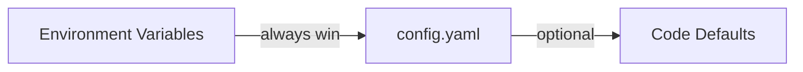

## Good defaults

GoModel uses a good defaults philosophy. This means that the default settings should be enough to use it.

## How to override the default settings?

We use a three-layer configuration pipeline. Every setting has a sensible default, so you can start the server with zero configuration.

{/* Environment Variables (always win) → config.yaml (optional) → Code Defaults */}



<Tip>
  As GoModel works out of the box with no configuration files, you can try it in
  a minute.

Start here: [Quick Start](/getting-started/quickstart)

</Tip>

GoModel automatically discovers providers from well-known environment variables.

## Configuration Methods

### 1. Environment Variables

The most common way to configure GoModel. Set any of the variables below to override defaults.

#### Server

| Variable             | Description                                           | Default                |
| -------------------- | ----------------------------------------------------- | ---------------------- |
| `PORT`               | HTTP server port                                      | `8080`                 |
| `BASE_PATH`          | Mount path prefix, for example `/g`                   | `/`                    |
| `GOMODEL_MASTER_KEY` | Authentication key for securing the gateway           | _(empty, unsafe mode)_ |
| `GOMODEL_DEMO_MODE`  | Enable public demo warnings in logs and the dashboard  | `false`                |
| `BODY_SIZE_LIMIT`    | Max request body size (e.g., `10M`, `1024K`, `500KB`) | _(no limit)_           |
| `STREAM_STALL_TIMEOUT` | Seconds one response write on a model route may wait for the client to read it; `0` disables | `60`                   |
| `USER_PATH_HEADER`   | Header used to read/write request `user_path` values  | `X-GoModel-User-Path`  |
| `SWAGGER_ENABLED`    | Expose [Swagger UI](/advanced/swagger-ui); needs a `-tags=swagger` build | `false`                |
| `AUTH_VERIFY_ENABLED` | Expose [`GET /v1/auth/verify`](/advanced/api-endpoints#key-verification), which reports whether the API key a request carries is valid | `false`                |
| `PID_FILE`           | Where the running gateway records its process id for `gomodel --reload`. Changing it needs a restart | `data/gomodel.pid` next to a `./data` directory, otherwise the per-user data directory |

`STREAM_STALL_TIMEOUT` (`server.stream_stall_timeout` in YAML) protects the
gateway from clients that open a streaming response and stop reading it. Each
write to the client gets a fresh deadline, so it fires only when the client's
socket stays full for that long, never while a slow model has nothing to send.
When it fires the connection is closed, the upstream provider request is
cancelled, and the audit entry records `client_stalled`, also when the stream
was served from the response cache. Raise it for clients that legitimately
pause reading a stream for over a minute; set `0` to disable.

Set `GOMODEL_DEMO_MODE=true` for a public or shared demonstration instance.
GoModel logs a warning at startup and every five minutes, renders a persistent
warning at the top of the dashboard, and exposes `DEMO_MODE=on` through the
allowlisted `/admin/runtime/config` response. Demo mode does not reset storage;
schedule that separately in the deployment.

Demo mode also does not bypass authentication. A startup log mode of
`managed_keys` means the configured storage still contains at least one managed
gateway API key, so requests require a bearer token even when
`GOMODEL_MASTER_KEY` is empty. Disabled or expired managed keys keep
authentication enabled as a fail-closed safety measure. Delete every managed
key to return to unauthenticated mode, or configure a master key for recovery.

#### MCP Gateway

See [MCP Gateway](/features/mcp-gateway) for the full feature guide.

| Variable      | Description                                                                                                                      | Default            |
| ------------- | -------------------------------------------------------------------------------------------------------------------------------- | ------------------ |
| `MCP_ENABLED` | Expose the MCP endpoints `/mcp` and `/mcp/{server}`                                                                              | `true`             |
| `MCP_SERVERS` | JSON object of upstream MCP servers, merged over the `mcp.servers` YAML map per name (entries are read-only in the dashboard)     | _(none)_           |
| `MCP_ALLOWED_ORIGINS` | Comma-separated browser origins (`scheme://host[:port]`) allowed to call `/mcp`; the default trusts none, which is what blocks DNS rebinding. `*` disables the check | _(none)_           |

#### Logging

Runtime logger output. For the persisted API audit trail (request/response
bodies, headers), see [Audit Logging](#audit-logging) below.

| Variable     | Description                                                                                                                                                                       | Default              |
| ------------ | --------------------------------------------------------------------------------------------------------------------------------------------------------------------------------- | -------------------- |
| `LOG_FORMAT` | `text` for colorized human output, `json` for structured logs. Unset auto-detects: text on a TTY, JSON otherwise. Force `json` in production / CloudWatch / Datadog / GCP setups. | _(auto-detect)_      |
| `LOG_LEVEL`  | Minimum log level: `debug`, `info`, `warn`, `error`. Aliases `dbg`, `inf`, `warning`, `err` are also accepted.                                                                    | `info`               |

#### Cache

| Variable            | Description                       | Default          |
| ------------------- | --------------------------------- | ---------------- |
| `GOMODEL_CACHE_DIR` | Directory for local cache files   | `.cache`         |
| `CACHE_REFRESH_INTERVAL` | Seconds between provider model re-discovery runs | `3600` (1h) |
| `PROVIDER_RECHECK_INTERVAL` | Seconds between re-probes of providers whose last refresh failed (`0` disables) | `60` |
| `MODEL_LIST_URL`    | Model metadata catalog: an HTTP URL, a local file path (`/etc/gomodel/models.json` or `file://...`), or `off` | public catalog on GitHub |
| `GOMODEL_OFFLINE`   | Air-gap switch: disables the update check and drops HTTP catalog URLs. Local catalog files and configured providers are unaffected | `false` |
| `REDIS_URL`         | Redis connection URL              | _(empty)_        |
| `REDIS_KEY_MODELS`     | Redis key for model cache           | `gomodel:models`    |
| `REDIS_KEY_RESPONSES`  | Redis key for response cache        | `gomodel:response:` |
| `REDIS_TTL_MODELS`     | TTL in seconds for model cache      | `86400` (24h)    |
| `REDIS_TTL_RESPONSES`  | TTL in seconds for response cache   | `3600` (1h)      |

<Tip>
  See [Cache](/features/cache) for exact-cache behavior, response headers,
  analytics endpoints, and the note that `user_path` alone does not partition
  the exact cache.
</Tip>

<Note>
  `CACHE_REFRESH_INTERVAL` also sets how often the dashboard re-checks
  provider health ("Last checked"), and `PROVIDER_RECHECK_INTERVAL` how
  quickly a failed provider is re-probed for recovery. See
  [Resilience](/advanced/resilience#circuit-breaker-and-dashboard-provider-health).
</Note>

#### Storage

Storage is shared by audit logging, usage tracking, and future features like IAM.

| Variable             | Description                                   | Default           |
| -------------------- | --------------------------------------------- | ----------------- |
| `STORAGE_TYPE`       | Backend: `sqlite`, `postgresql`, or `mongodb` | `sqlite`          |
| `SQLITE_PATH`        | SQLite database file path                     | `data/gomodel.db` |
| `POSTGRES_URL`       | PostgreSQL connection string (aliases: `POSTGRES_URI`, `POSTGRESQL_URL`, `POSTGRESQL_URI`, `DATABASE_URL`) | _(empty)_ |
| `POSTGRES_MAX_CONNS` | PostgreSQL connection pool size               | `10`              |
| `MONGODB_URL`        | MongoDB connection string; a database named in its path is used (aliases: `MONGO_URI`, `MONGO_URL`, `MONGODB_URI`) | _(empty)_ |
| `MONGODB_DATABASE`   | MongoDB database name; overrides the URL path (alias: `MONGO_DATABASE`) | `gomodel`         |

<Note>
  The aliases exist for platforms that inject their own connection variable
  names (for example NexusAI injects `DATABASE_URL`, `MONGO_URI`, and
  `MONGO_DATABASE`). When both a canonical name and an alias are set, the
  canonical name wins.
</Note>

<Warning>
  **Upgrading a PostgreSQL deployment past v0.1.59.** The `workflow_versions`
  table stored `created_at` as `TIMESTAMPTZ` on PostgreSQL and as unix seconds
  on SQLite. The two are now unified on unix seconds, and the first startup
  converts the column in place. No manual migration is needed, but the change
  is one-way: an older binary started against a converted database fails to
  boot. Take a backup before upgrading if you may need to roll back, and roll
  back by restoring it rather than by swapping the binary. Workflow
  `created_at` values are floored to whole seconds and rendered in UTC.
  SQLite and MongoDB deployments are unaffected.
</Warning>

#### Audit Logging

| Variable                          | Description                                | Default |
| --------------------------------- | ------------------------------------------ | ------- |
| `LOGGING_ENABLED`                 | Enable audit logging                       | `true`  |
| `LOGGING_LOG_BODIES`              | Log request/response bodies                | `true`  |
| `LOGGING_LOG_REVISION_BODIES`     | Log rewritten bodies from request rewriters and prompt guardrails | `true`  |
| `LOGGING_LOG_GUARDRAIL_STEPS`     | One audit revision per editing prompt guardrail (off: one per chain) | `true`  |
| `LOGGING_LOG_AUDIO_BODIES`        | Log audio endpoint inputs/outputs          | `false` |
| `LOGGING_LOG_IMAGE_BODIES`        | Log image endpoint inputs/outputs          | `false` |
| `LOGGING_LOG_IMAGE_BODIES_SCOPE`  | Which image bytes to store: `all`, `input`, `output` | `all` |
| `LOGGING_LOG_HEADERS`             | Log headers (sensitive ones auto-redacted) | `true`  |
| `LOGGING_ONLY_MODEL_INTERACTIONS` | Only log AI model endpoints                | `true`  |
| `LOGGING_BUFFER_SIZE`             | In-memory buffer before flush              | `1000`  |
| `LOGGING_FLUSH_INTERVAL`          | Flush interval in seconds                  | `5`     |
| `LOGGING_RETENTION_DAYS`          | Auto-delete after N days (0 = forever)     | `30`    |

Realtime dashboard previews and persisted audit logs are separate features.
With `DASHBOARD_LIVE_LOGS_ENABLED=true` and `LOGGING_ENABLED=false`, requests
can appear live but are not written to storage and disappear after a page
refresh. When audit logging is enabled, writes are asynchronous and can take up
to `LOGGING_FLUSH_INTERVAL` seconds to appear through the stored-log API.

<Note>
  On PostgreSQL, the audit log's free-text search uses a trigram index from the
  bundled `pg_trgm` extension. GoModel installs the extension and builds the
  index on startup when its database role is allowed to; otherwise the search
  still works but scans every entry in the selected date range. To enable it on
  a restricted role, run `CREATE EXTENSION pg_trgm;` as a superuser once and
  restart GoModel.
</Note>

<Warning>
  When `LOGGING_LOG_BODIES` is enabled, request and response bodies are stored
  in full. These may contain sensitive data such as PII or API keys embedded in
  prompts.
</Warning>

<Note>
  `LOGGING_LOG_REVISION_BODIES` refines `LOGGING_LOG_BODIES` for the ingress
  request-rewrite chain — it has no effect unless body logging is enabled. With
  both on, every rewriter that changed a request (for example GoModel Pro token
  compression) and every prompt guardrail that edited the prompt store the
  request as they left it alongside the original client body in the audit
  entry, so a chain of edits reads step by step. `LOGGING_LOG_GUARDRAIL_STEPS`
  controls that per-step record (the request bodies are encoded off the request
  path): turn it off to record a chain's edits as one revision carrying the
  request as forwarded, with no per-step snapshots.
  Disabling `LOGGING_LOG_REVISION_BODIES` keeps the revision metadata (rewriter name, byte sizes, tokens
  saved, change detail) but drops the extra body copies, roughly halving audit
  storage per rewritten request.
</Note>

<Note>
  `LOGGING_LOG_AUDIO_BODIES` refines `LOGGING_LOG_BODIES` for audio endpoints —
  it has no effect unless body logging is enabled. With both on, `/v1/audio/speech`
  stores its text input and the generated audio (base64, capped at 8 MB) so the
  dashboard can play it back, and `/v1/audio/transcriptions` stores the uploaded
  audio (base64, capped at 8 MB, also playable) plus its upload metadata. It
  defaults to `false` because audio payloads are
  large and grow the audit store quickly. When body logging is on but this is off,
  audio bodies (the speech response and the transcription upload, which keeps its
  metadata) are recorded as a lightweight `{__audio__, content_type, bytes, stored: false}`
  placeholder; when body logging is off, no audio body is stored at all.
</Note>

<Note>
  `LOGGING_LOG_IMAGE_BODIES` refines `LOGGING_LOG_BODIES` for the
  [Images API](/advanced/images-api) — it has no effect unless body logging is
  enabled. With both on, generated images (`/v1/images/generations`,
  `/v1/images/edits`) and uploaded edit sources and masks are stored as base64
  (8 MB per entry, images beyond the budget become placeholders) so the
  dashboard can display them. `LOGGING_LOG_IMAGE_BODIES_SCOPE` narrows this to
  `input` (uploads only) or `output` (results only); the default `all` stores
  both. It defaults to `false` because image payloads are large and grow the
  audit store quickly. When body logging is on but this is off, image entries
  keep everything except the pixels: the prompt and parameters, the response
  envelope (`usage`, `size`, `quality`), hosted URLs, and a sized
  `{role, content_type, bytes, stored: false}` placeholder per image.
</Note>

#### Token Usage Tracking

| Variable                       | Description                                    | Default |
| ------------------------------ | ---------------------------------------------- | ------- |
| `USAGE_ENABLED`                | Enable token usage tracking                    | `true`  |
| `USAGE_PRICING_RECALCULATION_ENABLED` | Enable the admin usage pricing recalculation action when supported | `true` |
| `ENFORCE_RETURNING_USAGE_DATA` | Auto-add `include_usage` to streaming requests | `true`  |
| `USAGE_BUFFER_SIZE`            | In-memory buffer before flush                  | `1000`  |
| `USAGE_FLUSH_INTERVAL`         | Flush interval in seconds                      | `5`     |
| `USAGE_RETENTION_DAYS`         | Auto-delete after N days (0 = forever)         | `90`    |

#### Budgets

Budgets use tracked usage cost records. If usage tracking is disabled, GoModel
starts with budget management disabled and logs a warning.

| Variable            | Description                                             | Default |
| ------------------- | ------------------------------------------------------- | ------- |
| `BUDGETS_ENABLED`   | Enable budget management and workflow budget checks when usage tracking is enabled | `true`  |
| `SET_BUDGET_<PATH>` | Seed budget limits for a user path, such as `daily=10` | _(empty)_ |

`SET_BUDGET_<PATH>` supports the standard periods `hourly`, `daily`, `weekly`,
and `monthly`. The `<PATH>` suffix is lowercased; use double underscores
(`__`) between path segments, while single underscores stay inside a segment.
For example, `SET_BUDGET_TEAM__ALPHA__SERVICE="daily=10"` configures
`/team/alpha/service`, and `SET_BUDGET_TEAM_ALPHA="daily=10"` configures
`/team_alpha`. This differs from provider `<SUFFIX>` variables below, which
convert underscores to hyphens in provider names.

`SET_BUDGET_="monthly=500"` means a literal environment variable named
`SET_BUDGET_`, which configures the root path `/`. POSIX permits that name, but
some shells and orchestrators, including some Kubernetes validators, may reject
it. Use YAML or the dashboard when your environment cannot set it.

Migration note: budget management depends on usage tracking. If
`USAGE_ENABLED=false`, GoModel starts with budgets disabled and logs a warning,
even when `BUDGETS_ENABLED=true`. Set both `USAGE_ENABLED=true` and
`BUDGETS_ENABLED=true` to enforce budgets.

See [Budgets](/features/budgets) for YAML examples, periods, matching, and
workflow enforcement.

#### Metrics

<Note>
  Prometheus support is **experimental**. See the
  [Prometheus Metrics guide](/guides/prometheus-metrics) for details.
</Note>

| Variable           | Description                              | Default    |
| ------------------ | ---------------------------------------- | ---------- |
| `METRICS_ENABLED`  | Enable Prometheus metrics (experimental) | `false`    |
| `METRICS_ENDPOINT` | HTTP path for metrics                    | `/metrics` |
| `OTEL_ENABLED`     | Export OpenTelemetry traces and metrics over OTLP (see [OpenTelemetry](/guides/opentelemetry)) | `false`    |

#### Admin

| Variable                              | Description                                      | Default |
| ------------------------------------- | ------------------------------------------------ | ------- |
| `ADMIN_ENDPOINTS_ENABLED`             | Enable the admin REST API                        | `true`  |
| `ADMIN_UI_ENABLED`                    | Enable the admin dashboard UI                    | `true`  |
| `DASHBOARD_LIVE_LOGS_ENABLED`         | Stream realtime dashboard audit/usage previews   | `true`  |
| `DASHBOARD_LIVE_LOGS_BUFFER_SIZE`     | In-memory replay window for live dashboard events | `10000` |
| `DASHBOARD_LIVE_LOGS_REPLAY_LIMIT`    | Max events replayed to one reconnecting client   | `1000`  |
| `DASHBOARD_LIVE_LOGS_HEARTBEAT_SECONDS` | Idle stream heartbeat interval in seconds      | `15`    |

Live dashboard logs are compact previews for the Audit Logs and Usage pages.
They update rows before the async database flush finishes. The stored audit and
usage tables remain the source of truth; if a browser reconnects with a cursor
outside the replay window, the dashboard reloads from the normal REST APIs.

#### HTTP Client

These control timeouts for upstream API requests to LLM providers.

| Variable                       | Description                                  | Default        |
| ------------------------------ | -------------------------------------------- | -------------- |
| `HTTP_TIMEOUT`                 | Overall request timeout in seconds           | `600` (10 min) |
| `HTTP_RESPONSE_HEADER_TIMEOUT` | Time to wait for response headers in seconds | `600` (10 min) |

#### Provider API Keys

Set these to automatically register providers. No YAML configuration required.

| Variable             | Provider                                           |
| -------------------- | -------------------------------------------------- |
| `OPENAI_API_KEY`     | OpenAI                                             |
| `ANTHROPIC_API_KEY`  | Anthropic                                          |
| `COHERE_API_KEY`     | Cohere                                             |
| `GEMINI_API_KEY`     | Google Gemini                                      |
| `DEEPSEEK_API_KEY`   | DeepSeek                                           |
| `OPENROUTER_API_KEY` | OpenRouter                                         |
| `KILO_API_KEY`       | Kilo AI Gateway                                    |
| `ZAI_API_KEY`        | Z.ai                                               |
| `XAI_API_KEY`        | xAI (Grok)                                         |
| `GROQ_API_KEY`       | Groq                                               |
| `CHUTES_API_KEY`     | Chutes AI (`CHUTES_BASE_URL` optional)             |
| `AZURE_API_KEY`      | Azure OpenAI (`AZURE_BASE_URL` also required)     |
| `ORACLE_API_KEY`     | Oracle GenAI (`ORACLE_BASE_URL` also required)    |
| `OLLAMA_BASE_URL`    | Ollama (no API key needed)                        |
| `SGLANG_BASE_URL`    | SGLang (no API key needed unless upstream requires) |
| `VLLM_BASE_URL`      | vLLM (no API key needed unless upstream requires) |
| `LLAMACPP_BASE_URL`  | llama.cpp llama-server / LM Studio (no API key needed unless started with `--api-key`) |
| `LLMD_BASE_URL`      | llm-d Router/EPP (no API key needed unless its Gateway requires one) |

Most providers can use a custom base URL via `<PROVIDER>_BASE_URL` (for example `OPENAI_BASE_URL`). Chutes AI defaults to `https://llm.chutes.ai/v1` and can be overridden with `CHUTES_BASE_URL`. DeepSeek defaults to `https://api.deepseek.com`; set `DEEPSEEK_BASE_URL` only for a compatible proxy or alternate DeepSeek endpoint. OpenRouter defaults to `https://openrouter.ai/api/v1` and can be overridden with `OPENROUTER_BASE_URL`. Kilo AI defaults to `https://api.kilo.ai/api/gateway` and can be overridden with `KILO_BASE_URL`. Z.ai defaults to `https://api.z.ai/api/paas/v4`; set `ZAI_BASE_URL=https://api.z.ai/api/coding/paas/v4` for the GLM Coding Plan endpoint. SGLang defaults to `http://localhost:30000/v1` when `SGLANG_API_KEY` is set, but keyless deployments should set `SGLANG_BASE_URL` explicitly to register the provider. vLLM follows the same pattern at `http://localhost:8000/v1`. llama.cpp's `LLAMACPP_BASE_URL` is always required (llama-server's default port collides with GoModel's own 8080, so there is no default); `LLAMACPP_API_KEY` is optional. llm-d has no universal endpoint, so `LLMD_BASE_URL` is always required; `LLMD_API_KEY` is optional. Azure uses `AZURE_BASE_URL` for its deployment base URL and accepts an optional `AZURE_API_VERSION` override; otherwise it defaults to `2024-10-21`. Oracle requires `ORACLE_BASE_URL` because its OpenAI-compatible endpoint is region-specific.

Every provider type also accepts a comma-separated configured model list via
`<PROVIDER>_MODELS`, for example `OPENROUTER_MODELS`, `ORACLE_MODELS`,
`AZURE_MODELS`, `SGLANG_MODELS`, `VLLM_MODELS`, or `LLMD_MODELS`. By default,
`CONFIGURED_PROVIDER_MODELS_MODE=fallback` uses configured lists only when
upstream `/models` fails, returns nil, or returns an empty list. Set
`CONFIGURED_PROVIDER_MODELS_MODE=allowlist` to expose only configured models for
providers that define a list and skip their upstream `/models` calls. YAML
`providers.<name>.models` provides the same model-list input for named provider
blocks.

`GET /v1/models` lists provider-qualified IDs (`openai/gpt-5`) by default. Set
`UNQUALIFIED_MODEL_IDS_AT_MODELS_ENDPOINT=true` (YAML:
`models.unqualified_model_ids_at_models_endpoint`) to list bare model IDs
(`gpt-5`) instead, for clients that validate the requested model against the
list and only know plain names. Caveat: when two providers expose the same
model ID, only the provider an unqualified request routes to (the first
registered one) is listed. Pin a name to a specific provider with a
[virtual model](/features/virtual-models#list-bare-model-ids), for example
`source: gpt-5` with `target: azure/gpt-5`.

To narrow a provider's inventory instead of listing it model by model, use
`<PROVIDER>_MODEL_FILTER_INCLUDE`, `<PROVIDER>_MODEL_FILTER_EXCLUDE`, and
`<PROVIDER>_MODEL_FILTER_MAX_PRICE_PER_MTOK` (YAML:
`providers.<name>.model_filter`). See
[Filtering a provider's models](/advanced/config-yaml#filtering-a-providers-models).

For OpenRouter, GoModel also sends default attribution headers unless the request already sets them. Override those defaults with `OPENROUTER_SITE_URL` and `OPENROUTER_APP_NAME`.

### 2. `.env` File

GoModel automatically loads a `.env` file from the working directory at startup. This is convenient for local development.

```bash
# .env
PORT=3000
BASE_PATH=/g
OPENAI_API_KEY=sk-...
ANTHROPIC_API_KEY=sk-ant-...
```

Copy `.env.template` to `.env` and uncomment the values you need:

```bash
cp .env.template .env
```

<Note>
  Real environment variables always override values from the `.env` file. The
  `.env` file is only loaded if it exists — missing it is not an error.
</Note>

### 3. Configuration File (YAML)

For more complex setups, you can use an optional YAML configuration file. GoModel looks for it in two locations (in order):

1. `config/config.yaml`
2. `config.yaml`

If you are deciding whether you need YAML at all, see
[config.yaml](/advanced/config-yaml).

To get started, copy the example:

```bash
cp config/config.example.yaml config/config.yaml
```

Then uncomment and edit the settings you want to change:

```yaml
server:
  port: "3000"
  base_path: "/g"
  user_path_header: "X-GoModel-User-Path"
  master_key: "my-secret-key"

cache:
  model:
    redis:
      url: "redis://my-redis:6379"

budgets:
  enabled: true
  user_paths:
    - path: "/team/alpha"
      limits:
        - period: "daily"
          amount: 10.00
        - period: "weekly"
          amount: 50.00

providers:
  openai:
    type: openai
    api_key: "sk-..."

  anthropic:
    type: anthropic
    api_key: "sk-ant-..."

  # Custom OpenAI-compatible provider
  my-custom-llm:
    type: openai
    base_url: "https://api.example.com/v1"
    api_key: "..."
```

The YAML file supports environment variable expansion using `${VAR}` and `${VAR:-default}` syntax:

```yaml
server:
  port: "${PORT:-8080}"

providers:
  openai:
    type: openai
    api_key: "${OPENAI_API_KEY}"
```

<Tip>
  The YAML file is entirely optional. Any setting you can put in YAML can also
  be set via environment variables. Use YAML when you need per-provider
  resilience overrides, generated provider names are not enough, or you prefer
  a structured config file.
</Tip>

## Provider Configuration

### Auto-Discovery from Environment Variables

The simplest way to add providers. GoModel checks for well-known API key environment variables and automatically registers providers:

```bash
export OPENAI_API_KEY="sk-..."      # Registers "openai" provider
export ANTHROPIC_API_KEY="sk-ant-..." # Registers "anthropic" provider
export COHERE_API_KEY="..."           # Registers "cohere" provider
export GEMINI_API_KEY="..."          # Registers "gemini" provider
export DEEPSEEK_API_KEY="..."        # Registers "deepseek" provider
export XAI_API_KEY="..."             # Registers "xai" provider
export GROQ_API_KEY="gsk_..."        # Registers "groq" provider
export CHUTES_API_KEY="cpk_..."      # Registers "chutes" provider
export OPENROUTER_API_KEY="sk-or-..." # Registers "openrouter" provider
export KILO_API_KEY="..."            # Registers "kilo" provider
export ZAI_API_KEY="..."             # Registers "zai" provider
# Optional: export ZAI_BASE_URL="https://api.z.ai/api/coding/paas/v4"
export AZURE_API_KEY="..."           # Registers "azure" provider when paired with AZURE_BASE_URL
export AZURE_BASE_URL="https://your-resource.openai.azure.com/openai/deployments/your-deployment"
export ORACLE_API_KEY="..."          # Registers "oracle" provider when paired with ORACLE_BASE_URL
export ORACLE_BASE_URL="https://inference.generativeai.us-chicago-1.oci.oraclecloud.com/20231130/actions/v1"
export ORACLE_MODELS="openai.gpt-oss-120b,xai.grok-3" # Optional configured model list
export OPENROUTER_MODELS="openai/gpt-oss-120b,anthropic/claude-sonnet-4"
export KILO_MODELS="anthropic/claude-sonnet-4.5,openai/gpt-5.5"
export CONFIGURED_PROVIDER_MODELS_MODE="fallback" # fallback or allowlist
export OLLAMA_BASE_URL="http://localhost:11434/v1" # Registers "ollama" provider
export SGLANG_BASE_URL="http://localhost:30000/v1" # Registers keyless "sglang" provider
# Optional: export SGLANG_API_KEY="token-abc123"
export VLLM_BASE_URL="http://localhost:8000/v1" # Registers keyless "vllm" provider
# Optional: export VLLM_API_KEY="token-abc123"
export LLMD_BASE_URL="http://quickstart-epp.llm-d.svc.cluster.local/v1" # Registers keyless "llmd" provider
export LLMD_MODELS="Qwen/Qwen2.5-0.5B-Instruct"
# Optional: export LLMD_INFERENCE_OBJECTIVE="standard-traffic"
# Optional: export LLMD_FAIRNESS_FROM_USER_PATH="true"
```

Bare `<PROVIDER>_*` variables win over the `config.yaml` provider named after
the type (`openai`). A provider you renamed (`alpha: {type: openai}`) only picks
up fields it left empty; its explicit `api_key` or `base_url` is kept and the
ignored variables are logged as a warning at startup. When several renamed
providers share a type, the bare variables are ignored with the same warning.

Use suffixed variables to register more than one instance of the same provider
type without YAML. GoModel normalizes the suffix to lowercase and converts
underscores to hyphens in the configured provider name:

```bash
export OPENAI_EAST_API_KEY="sk-..." # Registers "openai-east", type "openai"
export OPENAI_EAST_BASE_URL="https://east.example.com/v1"

export OPENAI_WEST_API_KEY="sk-..." # Registers "openai-west", type "openai"
export OPENAI_WEST_BASE_URL="https://west.example.com/v1"
```

The same pattern works for every registered provider type:
`<PROVIDER>_<SUFFIX>_API_KEY`, `<PROVIDER>_<SUFFIX>_BASE_URL`, and
`<PROVIDER>_<SUFFIX>_MODELS`. Azure also supports
`<PROVIDER>_<SUFFIX>_API_VERSION`. Azure and Oracle still require their
suffixed `BASE_URL` values because their endpoints are deployment- or
region-specific.

Google Vertex AI uses the `VERTEX_*` prefix and follows the same
suffix-to-name rule as other providers:

```bash
export VERTEX_PROJECT="prod-ai"
export VERTEX_LOCATION="us-central1" # Registers "vertex", type "vertex"

export VERTEX_US_PROJECT="prod-ai"
export VERTEX_US_LOCATION="us-central1" # Registers "vertex-us", type "vertex"
```

### YAML Provider Blocks

For more control (custom names, per-provider resilience, or larger structured
settings), use the YAML file:

```yaml
models:
  # fallback is the default. Use allowlist when configured provider model lists
  # should hide upstream models and skip upstream /models calls, or merge to add
  # configured models on top of the discovered inventory (models a provider
  # serves but does not list).
  configured_provider_models_mode: fallback
  # List bare model IDs (gpt-5) from GET /v1/models instead of provider-qualified
  # ones (openai/gpt-5). When two providers expose the same ID only the provider an
  # unqualified request routes to (the first registered one) is listed; pin a name
  # with a virtual model (source gpt-5 -> target azure/gpt-5).
  unqualified_model_ids_at_models_endpoint: false

providers:
  # Override OpenAI base URL
  openai:
    type: openai
    api_key: "sk-..."
    base_url: "https://my-proxy.example.com/v1"

  # Add a second OpenAI-compatible endpoint
  azure:
    type: azure
    base_url: "https://my-resource.openai.azure.com/openai/deployments/gpt-4"
    api_key: "..."
    api_version: "2024-10-21"

  # Add Oracle's OpenAI-compatible endpoint
  oracle:
    type: oracle
    base_url: "https://inference.generativeai.us-chicago-1.oci.oraclecloud.com/20231130/actions/v1"
    api_key: "..."
    models:
      - openai.gpt-oss-120b
      - xai.grok-3

  # Add DeepSeek. GoModel translates /v1/responses to DeepSeek chat completions.
  deepseek:
    type: deepseek
    base_url: "https://api.deepseek.com"
    api_key: "..."

  # Add a vLLM OpenAI-compatible server
  vllm:
    type: vllm
    base_url: "http://localhost:8000/v1"
    # api_key is optional; set it only when vllm serve uses --api-key.
    # api_key: "token-abc123"

  # Add an SGLang OpenAI-compatible server
  sglang:
    type: sglang
    base_url: "http://localhost:30000/v1"
    # api_key is optional; set it only when launch_server uses --api-key.
    # api_key: "token-abc123"

  # Configure a model list for fallback or allowlist mode
  gemini:
    type: gemini
    api_key: "..."
    models:
      - gemini-2.0-flash
      - gemini-1.5-pro

  # Add Google Vertex AI. Project and location are required.
  vertex:
    type: vertex
    auth_type: gcp_adc
    vertex_project: "prod-ai"
    vertex_location: "us-central1"
    api_mode: native
    models:
      - google/gemini-2.5-flash
```

<Note>
  `models:` works for every provider block. In fallback mode it is a safety net
  when upstream `/models` is unavailable or empty. In allowlist mode it becomes
  the exposed inventory for that provider and skips upstream `/models`. For Oracle GenAI, see the [Oracle GenAI
  guide](/providers/oracle) for the required OCI policy and a tested configuration.
</Note>

### Ollama (Local Models)

Ollama does not require an API key. Set the base URL to enable it:

```bash
export OLLAMA_BASE_URL="http://localhost:11434/v1"
```

Or in YAML:

```yaml
providers:
  ollama:
    type: ollama
    base_url: "http://localhost:11434/v1"
```

### vLLM

vLLM uses its OpenAI-compatible `/v1` API. In Docker, set `VLLM_BASE_URL` to
register a keyless vLLM server:

```bash
docker run --rm -p 8080:8080 \
  -e GOMODEL_MASTER_KEY="change-me" \
  -e VLLM_BASE_URL="http://host.docker.internal:8000/v1" \
  enterpilot/gomodel
```

If the upstream server was started with `vllm serve ... --api-key token-abc123`,
also set:

```bash
docker run --rm -p 8080:8080 \
  -e GOMODEL_MASTER_KEY="change-me" \
  -e VLLM_BASE_URL="http://host.docker.internal:8000/v1" \
  -e VLLM_API_KEY="token-abc123" \
  enterpilot/gomodel
```

You can also register more than one vLLM instance without YAML:

```bash
docker run --rm -p 8080:8080 \
  -e GOMODEL_MASTER_KEY="change-me" \
  -e VLLM_BASE_URL="http://host.docker.internal:8000/v1" \
  -e VLLM_TEST_BASE_URL="http://host.docker.internal:8000/v1" \
  enterpilot/gomodel
```

This registers providers `vllm` and `vllm-test`. Use YAML only when the
generated provider names are not enough or you need a larger structured block.

## Provider Behavior Notes

### Anthropic `max_tokens` default

Anthropic requires `max_tokens` on every `/v1/messages` request. If a client
omits it, GoModel injects a fallback so the request still succeeds. OpenAI and
Gemini treat the field as optional and GoModel does not inject a default for
them.

| Variable                       | Description                                       | Default |
| ------------------------------ | ------------------------------------------------- | ------- |
| `ANTHROPIC_DEFAULT_MAX_TOKENS` | Value injected when the caller omits `max_tokens` | `4096`  |

Raise this for newer models that routinely produce longer outputs (Sonnet 4.6,
Opus 4.7). Setting `max_tokens` explicitly on a request always wins over the
env-driven default. Invalid or non-positive values fall back to `4096`.
