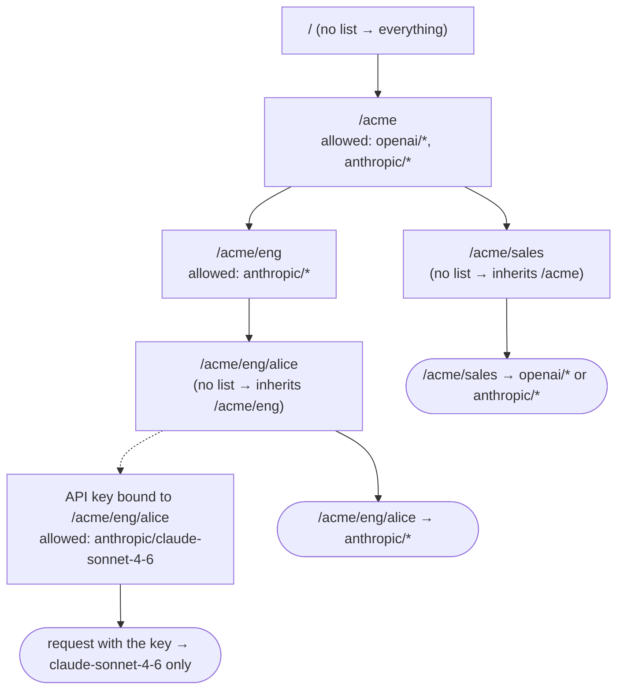
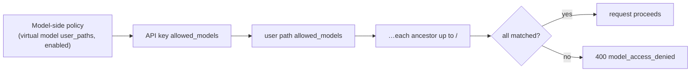

## Overview

The **Users** page turns the [`user_path`](/features/user-path) hierarchy
behind your API keys into a tree of groups and users, and lets each node
restrict which models requests under it may call:

- `/acme` and `/acme/eng` are **groups** — they contain other paths.
- `/acme/eng/alice` is a **user** — API keys are bound directly to it.

Nothing needs to be created up front. The tree is derived from the user paths
of existing API keys; add a policy to a node only when you want to restrict it.

## Rules

1. **New keys and nodes allow everything.** A node or key with no
   `allowed_models` imposes no restriction of its own.
2. **Listing models restricts.** Once a node lists models, requests under it
   may only use models matching that list.
3. **Lists intersect down the tree.** A request must satisfy the allowlist of
   its API key, of its user path, and of every ancestor up to `/`. A child
   can narrow what its group allows but never widen it.
4. Model-side rules still apply. A [virtual model access policy](/features/virtual-models)
   that hides a model from a subtree keeps hiding it.

`GET /v1/models` returns only the models the caller may use, so clients see
the same picture the gateway enforces.

Requests authenticated by other means follow the same path rules: an
[OIDC SSO](/pro/sso) session or a request carrying only the
user-path header is limited by the policies on its `user_path`; only managed
API keys additionally carry a per-key allowlist. The master key has no bound
user path: without the header it is unrestricted, with the header it is
scoped like any other request on that path.

## How access is resolved

Policies hang off the user-path tree and are combined top-down. Every list on
the way from the root to the request's path must match, and the API key's own
list is applied last:



For one request the gateway checks, in order:



Where the pieces come from:

| Piece                   | Source                                                       |
| ----------------------- | ------------------------------------------------------------ |
| the request's user path | the managed API key's `user_path`, an SSO session, or the `X-GoModel-User-Path` header |
| the tree                | derived from the user paths of existing API keys — nothing to create |
| node policies           | the **Users** page, `users:` in `config.yaml`, or the `USERS` env var |
| key policies            | the **API Keys** page or `allowed_models` on `POST /admin/auth-keys` |
| model-side policies     | [virtual models](/features/virtual-models) with `user_paths` or `enabled: false` |

A node without a list contributes nothing to the chain; it neither widens nor
narrows. This is why a new key or a fresh group starts with access to
everything, and why `/acme/sales` above still sees both providers.

## Selectors

Each entry in an allowlist is one selector:

| Entry              | Matches                                             |
| ------------------ | --------------------------------------------------- |
| `anthropic/*`      | every model of the `anthropic` provider             |
| `openai/gpt-4o`    | one model on one provider                           |
| `gpt-4o`           | that model ID on any provider                       |
| `*`                | every model; redundant unless you want an explicit row, and it never widens a parent's list (rule 3) |

Provider names must match a configured provider; unknown names are rejected
when the policy is saved. Virtual models are not selectors: an alias or a load
balancer resolves to the concrete provider model before the check runs, so allow
the target models, not the virtual model. A virtual model name in a list is
accepted as a bare model ID but never matches anything; a load balancer whose
targets span providers is only usable when every target it can pick is allowed,
otherwise requests fail with `400` whenever it picks a disallowed target. The
user tree shows such a node with an empty effective list.

## Example

```yaml
users:
  - path: /acme
    allowed_models: [openai/*, anthropic/*]
  - path: /acme/eng
    allowed_models: [anthropic/*]
    description: Engineering only ships on Claude
```

| Request user path  | `openai/gpt-4o` | `anthropic/claude-sonnet-4-6` |
| ------------------ | --------------- | ----------------------------- |
| `/acme/sales`      | allowed         | allowed                       |
| `/acme/eng/alice`  | denied          | allowed                       |
| `/other`           | allowed         | allowed                       |

An API key bound to `/acme/eng/alice` with its own
`allowed_models: [anthropic/claude-sonnet-4-6]` narrows Alice further to that
single model.

A denied request receives `400` with code `model_access_denied`.

## Managing policies

### Dashboard

`Users` lists every node with its own allowlist, its **effective models** —
the path-level result once its own list, every parent's list, and the
model-side virtual-model policies are applied (a red **None** flags a node
whose lists intersect to nothing) — and how many API keys are bound to it. A
managed API key's own `allowed_models` can narrow a request further than the
path shows. The editor warns while you type when the
list would leave no model available. Add or edit a node to
set its models; remove the policy to fall back to the parents' limits.

The key count links to the **API Keys** page filtered to that path's subtree,
and each row has an *Add API key* action that opens the create-key form with
the path prefilled.

Per-key allowlists live on the **API Keys** page: set `Allowed models` when
creating a key or edit them later from the key's row. Its **Effective models**
column is the final answer for that credential — path policies, the key's own
list, and model-side policies combined.

### Configuration

Declare policies in `config.yaml` under `users:` (see the example above) or
in the `USERS` environment variable as a JSON array with the same fields:

```bash
USERS='[{"path":"/acme/eng","allowed_models":["anthropic/*"]}]'
```

Declared policies shadow dashboard rows for the same path and are read-only
in the dashboard. A misspelled provider in a declared policy fails startup.

### Admin API

| Method   | Endpoint                                | Description                               |
| -------- | --------------------------------------- | ----------------------------------------- |
| `GET`    | `/admin/users`                          | The tree with own and inherited limits    |
| `PUT`    | `/admin/users`                          | Create or replace one node's policy       |
| `DELETE` | `/admin/users?user_path=/acme/eng`      | Remove one node's policy                  |
| `PUT`    | `/admin/auth-keys/{id}/allowed-models`  | Replace one API key's allowlist           |

`POST /admin/auth-keys` accepts `allowed_models` at creation time. See
[Admin Endpoints](/advanced/admin-endpoints) for request and response shapes.
